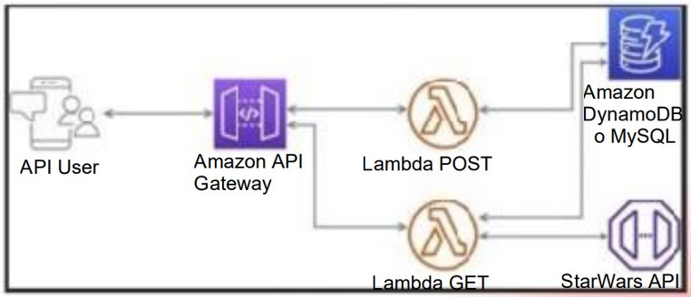

# 🏆 Reto Técnico - Backend NodeJS AWS

## 📝 Descripción del reto técnico:

- ✅ Adaptar y transformar los modelos de la API SWAPI a español, es decir tienenque mapear todos los nombres de los atributos del inglés al español. Ejemplo:{ “name” : “Luke”} cambiar a {“nombre” : ”Luke”}.
- ✅ Integrar la API de prueba StarWars API (líneas abajo está el link) se debenintegrar uno o más endpoints.
- ✅ Crear un modelo de su elección mediante el uso de un endpoint POST, la datase tendrá que almacenar dentro de una base de datos.
- ✅ Crear un endpoint GET que muestre la data almacenada.

API de prueba SWAPI: https://swapi.py4e.com/documentation

## 📒 Puntos mínimos-obligatorios del MVP:

- ✅ Mínimo 2 endpoints, GET para recuperar la información y POST para crear un elemento
- ✅ Integración con una base de datos (DynamoDB o MySQL)
- ✅ Integración con SWAPI
- ✅ Traducción de atributos de inglés a español
- ✅ Uso de Serverless Framework
- ✅ Uso de Node.js
- ✅ Respeto de las buenas prácticas de desarrollo

## ➕ Puntos Bonus:

- ✅ Pruebas unitarias
- ✅ Uso de TypeScript
- ✅ Documentación de uso
- ✅ Documentación en Open API/Swagger
- ✅ Desplegar sin errores en AWS con el comando deploy del framework serverless
- ✅ Mayor complejidad de Integración
- ✅ Uso de un framework (NestJS)
- ✅ Trabajar en capas y por dominio

### 🪄 Arquitectura recomendada



## 📁 Estructura del proyecto

```css
├── .serverless/
├── .vscode/
├── dist/
├── node_modules/
├── requests/
├── src/
|   ├── common/
|   |   ├── decorators/
|   |   ├── serializers/
|   ├── models/
|   |   ├── people/
|   |   |   ├── dto/
|   |   |   ├── entities/
|   |   |   ├── people.controller.ts
|   |   |   ├── people.module.ts
|   |   |   ├── people.service.ts
|   ├── providers/
|   |   ├── api/
|   |   ├── database/
|   ├── app.controller.spec.ts
|   ├── app.controller.ts
|   ├── app.module.ts
|   ├── app.service.ts
|   ├── app.ts
|   ├── lambda.ts
|   ├── main.ts
├── test/
├── .env
├── .env.example
├── .eslintrc.js
├── .gitignore
├── .prettierrc
├── docker-compose.yml
├── image.png
├── nest-cli.json
├── package.json
├── pnpm-lock.yaml
├── README.md
├── serverless.yml
├── tsconfig.build.json
└── tsconfig.json
```

## 💫 Instalacion del proyecto

```bash
$ pnpm install
```

## 👩‍💻 Pasos para ejecutar en local (`dev`) el proyecto

```bash
# Para instalar la Base de Datos (MySQL) con Docker
$ pnpm run deps

# Ejecutar el proyecto en modo `dev`
$ pnpm run dev
```

> ⚠️ Importante: tener declaradas las siguientes variables de entorno, revisar el archivo `.env.example`.

- `PORT`: Puerto del servidor. Ejemplo: `3000`
- `DATABASE_HOST`: Endpoint de la base de datos. Ejemplo: `localhost`
- `DATABASE_PORT`: Puerto de la base de datos. Ejemplo: `3306`
- `DATABASE_ROOT_PASSWORD`: Contraseña del usuario root de la base de datos. Ejemplo: `root`
- `DATABASE_NAME`: Nombre de la base de datos. Ejemplo: `swapi_db`
- `DATABASE_USER`: Nombre del usuario de la base de datos. Ejemplo: `superadmin`
- `DATABASE_PASSWORD`: Contraseña del usuario de la base de datos. Ejemplo: `Admin123456*`
- `SWAPI_API_URL`: URL de la API de Star Wars. Ejemplo: `https://swapi.py4e.com/api`

> 🧾 Nota: Se pueden usar los endpoints declarados en la carpeta `requests/`

Instalar con el plugin de VSCode [REST Client](https://marketplace.visualstudio.com/items?itemName=humao.rest-client)

```css
├── requests/
|   ├── dev/
|   ├── people/
|   |   ├── bulk-create.rest
|   |   ├── create.rest
|   |   ├── get-all.rest
|   ├── app.rest
└── (...)
```

## 🎉 Pasos para usar el proyecto

1. Primero poblar la base de datos con los personajes de Swapi API, llamar al siguiente endpoint desde el archivo `bulk-create.rest` o con el comando **curl**:

```bash
$ curl -X POST http://localhost:3000/api/people/bulk/ -H "Content-Type: application/json"
```

2. Visualizar la data almacenada en la base de datos, llamar al siguiente endpoint desde el archivo `get-all.rest` o con el comando curl:

```bash
$ curl -X GET http://localhost:3000/api/people/ -H "Content-Type: application/json"
```

3. Se puede agregar nuevos persoanjes en la base de datos llamando al siguiente endpoint desde el archivo `create.rest` o con el comando curl:

```bash
$ curl -X POST http://localhost:3000/api/people/create/ -H "Content-Type: application/json" -d '{ "name": "Luke" }'
```

## 🐛 Pasos para realizar pruebas del proyecto

Pruebas unitarias

```bash
$ pnpm run test
```

Pruebas e2e

```bash
$ pnpm run test:e2e
```

## 🚀 Pasos para desplegar en AWS (`prod`) el proyecto

Desde la terminal ejecutar el siguiente comando para configurar las credenciales de AWS:

```bash
### Ingresar las siguientes variable AWS_ACCESS_KEY_ID, AWS_SECRET_ACCESS_KEY y AWS_REGION en la terminal
$ aws configure

AWS Access Key ID [None]: $AWS_ACCESS_KEY_ID
AWS Secret Access Key [None]: $AWS_ACCESS_KEY_ID
Default region name [None]: $AWS_REGION
Default output format [None]: text
```

Desplegar el proyecto en AWS con Serverless Framework:

```bash
$ pnpm run deploy
```

> ⚠️ Importante: Adicionalmente se puede probar los endpoint en la carpeta `requests`

Despues de desplegar el proyecto, agregar el endpoint (la variable `BASE_API_URL`) en el archivo .env. Tener en consideración que puede demorar unos segundos en reflejarse el nuevo endpoint.

- `BASE_API_URL`: URL de la API en AWS. Ejemplo: `https://p92xfml1ml.execute-api.us-east-1.amazonaws.com/prod/docs`

```css
├── requests/
|   ├── prod/
|   ├── people/
|   |   ├── bulk-create.rest
|   |   ├── create.rest
|   |   ├── get-all.rest
|   ├── app.rest
└── (...)
```

O probar con CURL

1. Primero poblar la base de datos con los personajes de Swapi API, llamar al siguiente endpoint desde el archivo `bulk-create.rest` o con el comando **curl**:

```bash
$ curl -X POST $BASE_API_URL/prod/api/people/bulk/ -H "Content-Type: application/json"

### Ejemplo:
$ curl -X POST https://p92xfml1ml.execute-api.us-east-1.amazonaws.com/prod/api/people/bulk/ -H "Content-Type: application/json"
```

2. Visualizar la data almacenada en la base de datos, llamar al siguiente endpoint desde el archivo `get-all.rest` o con el comando curl:

```bash
$ curl -X GET $BASE_API_URL/prod/api/people/ -H "Content-Type: application/json"

### Ejemplo
$ curl -X GET https://p92xfml1ml.execute-api.us-east-1.amazonaws.com/prod/api/people/ -H "Content-Type: application/json"
```

3. Se puede agregar nuevos persoanjes en la base de datos llamando al siguiente endpoint desde el archivo `create.rest` o con el comando curl:

```bash
$ curl -X POST $BASE_API_URL/prod/api/people/create/ -H "Content-Type: application/json" -d '{ "name": "Luke" }'

### Ejemplo
$ curl -X POST https://p92xfml1ml.execute-api.us-east-1.amazonaws.com/prod/api/people/create/ -H "Content-Type: application/json" -d '{ "name": "Luke" }'
```

Ver la documentacion en la siguiente ruta:

```bash
## Modo dev
$ http://localhost:3000/docs

## Modo prod
$BASE_API_URL/prod/docs

### Ejemplo:
https://p92xfml1ml.execute-api.us-east-1.amazonaws.com/prod/docs
```

Al final las pruebas borrar el serverless creado con el siguiente commando:

```bash
$ pnpm run deploy:remove
```
